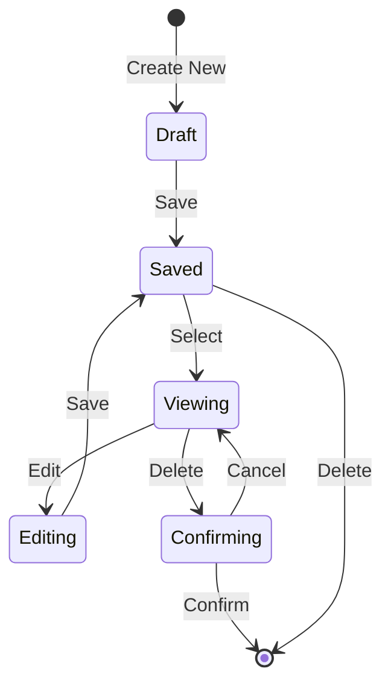
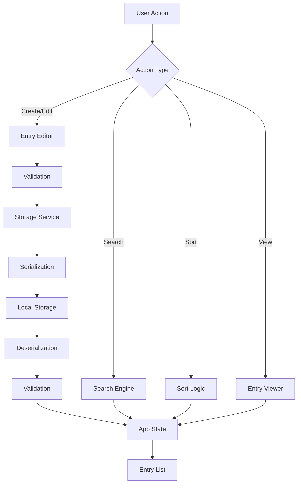
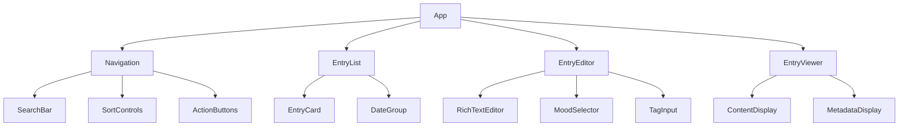

# Design Document: Journey Journal App

## Overview

The Journey Journal App is a privacy-focused, browser-based journaling application built with React. It provides users with a rich text editing experience for creating and managing personal journal entries, all stored locally in the browser's local storage. The application emphasizes simplicity, offline functionality, and data ownership.

### Key Design Principles

1. **Privacy First**: All data remains in the user's browser; no server communication required
2. **Offline Capable**: Full functionality without internet connectivity
3. **Data Integrity**: Robust serialization and validation to prevent data loss
4. **Responsive Design**: Seamless experience across desktop and mobile devices
5. **Simplicity**: Clean, intuitive interface that doesn't distract from writing

### Technology Stack

- **Frontend Framework**: React 18+ with functional components and hooks
- **State Management**: React Context API for global state (entries, search, sort preferences)
- **Rich Text Editor**: Draft.js or Lexical for rich text editing capabilities
- **Storage**: Browser Local Storage API
- **Styling**: CSS Modules or Styled Components for component-scoped styling
- **Build Tool**: Vite for fast development and optimized production builds
- **Type Safety**: TypeScript for type checking and improved developer experience

## Architecture

### High-Level Architecture

The application follows a component-based architecture with clear separation of concerns:

```
┌─────────────────────────────────────────────────────────────┐
│                        Journal App                           │
│  ┌───────────────────────────────────────────────────────┐  │
│  │              Application Context                       │  │
│  │  (Global State: entries, search, sort, preferences)   │  │
│  └───────────────────────────────────────────────────────┘  │
│                                                              │
│  ┌──────────────┐  ┌──────────────┐  ┌──────────────┐     │
│  │  Entry List  │  │Entry Editor  │  │Entry Viewer  │     │
│  │  Component   │  │  Component   │  │  Component   │     │
│  └──────────────┘  └──────────────┘  └──────────────┘     │
│         │                  │                  │             │
│         └──────────────────┴──────────────────┘             │
│                            │                                │
│  ┌─────────────────────────────────────────────────────┐   │
│  │              Storage Service Layer                   │   │
│  │  (Serialization, Validation, Local Storage Access)  │   │
│  └─────────────────────────────────────────────────────┘   │
│                            │                                │
│  ┌─────────────────────────────────────────────────────┐   │
│  │           Browser Local Storage API                  │   │
│  └─────────────────────────────────────────────────────┘   │
└─────────────────────────────────────────────────────────────┘
```

### Component Architecture

The application is structured into the following layers:

1. **Presentation Layer**: React components for UI rendering
   - EntryList: Displays all entries with sorting and filtering
   - EntryEditor: Rich text editor for creating/editing entries
   - EntryViewer: Read-only view of a single entry
   - SearchBar: Search input with real-time filtering
   - Navigation: App header with actions (create, export, import)

2. **Business Logic Layer**: Custom hooks and services
   - useEntries: Manages entry CRUD operations
   - useSearch: Handles search and filtering logic
   - useSort: Manages sorting preferences and logic
   - StorageService: Handles serialization and local storage operations
   - ValidationService: Validates entry data integrity

3. **Data Layer**: Local Storage abstraction
   - StorageAdapter: Wraps Local Storage API with error handling
   - Provides consistent interface for data persistence

### Data Flow

```
User Action → Component → Custom Hook → Storage Service → Local Storage
                ↓                                              ↓
            UI Update ← State Update ← Validation ← Deserialization
```

## Components and Interfaces

### Core Components

#### 1. App Component
The root component that provides application context and routing logic.

```typescript
interface AppProps {}

interface AppState {
  entries: Entry[];
  currentView: 'list' | 'editor' | 'viewer';
  selectedEntryId: string | null;
  searchQuery: string;
  sortOrder: SortOrder;
}
```

#### 2. EntryList Component
Displays a list of journal entries with sorting and filtering.

```typescript
interface EntryListProps {
  entries: Entry[];
  onSelectEntry: (entryId: string) => void;
  onDeleteEntry: (entryId: string) => void;
  onCreateEntry: () => void;
  sortOrder: SortOrder;
  onSortChange: (order: SortOrder) => void;
}
```

#### 3. EntryEditor Component
Rich text editor for creating and editing entries.

```typescript
interface EntryEditorProps {
  entry?: Entry; // undefined for new entries
  onSave: (entry: Entry) => void;
  onCancel: () => void;
}

interface EntryEditorState {
  title: string;
  content: EditorState; // Draft.js EditorState
  mood: Mood | null;
  tags: string[];
  isDirty: boolean;
}
```

#### 4. EntryViewer Component
Read-only display of a single entry with metadata.

```typescript
interface EntryViewerProps {
  entry: Entry;
  onEdit: () => void;
  onDelete: () => void;
  onBack: () => void;
}
```

#### 5. SearchBar Component
Search input with real-time filtering.

```typescript
interface SearchBarProps {
  query: string;
  onQueryChange: (query: string) => void;
  placeholder?: string;
}
```

#### 6. RichTextEditor Component
Wrapper around Draft.js or Lexical with formatting toolbar.

```typescript
interface RichTextEditorProps {
  initialContent: string;
  onChange: (content: EditorState) => void;
  placeholder?: string;
  maxLength?: number;
}
```

### Custom Hooks

#### useEntries Hook
Manages entry CRUD operations and persistence.

```typescript
interface UseEntriesReturn {
  entries: Entry[];
  loading: boolean;
  error: Error | null;
  createEntry: (entry: Omit<Entry, 'id' | 'createdAt'>) => Promise<Entry>;
  updateEntry: (id: string, updates: Partial<Entry>) => Promise<Entry>;
  deleteEntry: (id: string) => Promise<void>;
  getEntry: (id: string) => Entry | undefined;
  exportEntries: () => void;
  importEntries: (file: File) => Promise<void>;
}

function useEntries(): UseEntriesReturn;
```

#### useSearch Hook
Handles search and filtering logic.

```typescript
interface UseSearchReturn {
  query: string;
  setQuery: (query: string) => void;
  filteredEntries: Entry[];
}

function useSearch(entries: Entry[]): UseSearchReturn;
```

#### useSort Hook
Manages sorting preferences and logic.

```typescript
interface UseSortReturn {
  sortOrder: SortOrder;
  setSortOrder: (order: SortOrder) => void;
  sortedEntries: Entry[];
}

function useSort(entries: Entry[]): UseSortReturn;
```

### Service Interfaces

#### StorageService
Handles all local storage operations with serialization.

```typescript
interface StorageService {
  saveEntry(entry: Entry): Promise<void>;
  loadEntries(): Promise<Entry[]>;
  deleteEntry(id: string): Promise<void>;
  savePreferences(prefs: UserPreferences): Promise<void>;
  loadPreferences(): Promise<UserPreferences>;
  exportData(): string; // Returns JSON string
  importData(jsonString: string): Promise<Entry[]>;
  clearAll(): Promise<void>;
}
```

#### ValidationService
Validates entry data integrity.

```typescript
interface ValidationService {
  validateEntry(entry: unknown): entry is Entry;
  validateEntryArray(data: unknown): data is Entry[];
  sanitizeContent(content: string): string;
  validateImportData(data: unknown): ImportValidationResult;
}

interface ImportValidationResult {
  valid: boolean;
  errors: string[];
  validEntries: Entry[];
  invalidCount: number;
}
```

## Data Models

### Entry Model
Represents a single journal entry.

```typescript
interface Entry {
  id: string; // UUID v4
  title: string; // Max 200 characters
  content: string; // Rich text as HTML or JSON, max 100,000 characters
  createdAt: number; // Unix timestamp in milliseconds
  lastModifiedAt: number; // Unix timestamp in milliseconds
  mood: Mood | null;
  tags: string[];
  version: number; // Schema version for future migrations
}
```

### Mood Type
Predefined mood options for entries.

```typescript
type Mood = 
  | 'happy'
  | 'sad'
  | 'excited'
  | 'anxious'
  | 'calm'
  | 'grateful'
  | 'reflective'
  | 'energetic';

interface MoodOption {
  value: Mood;
  label: string;
  emoji: string;
  color: string;
}
```

### Sort Order Type
Defines available sorting options.

```typescript
type SortOrder = 
  | 'createdAt-desc'   // Newest first (default)
  | 'createdAt-asc'    // Oldest first
  | 'modifiedAt-desc'  // Recently modified first
  | 'modifiedAt-asc';  // Least recently modified first
```

### User Preferences Model
Stores user preferences in local storage.

```typescript
interface UserPreferences {
  sortOrder: SortOrder;
  theme: 'light' | 'dark' | 'auto';
  defaultMood: Mood | null;
  version: number;
}
```

### Storage Schema
The structure of data stored in local storage.

```typescript
// Local Storage Keys
const STORAGE_KEYS = {
  ENTRIES: 'journal_entries',
  PREFERENCES: 'journal_preferences',
  VERSION: 'journal_schema_version'
} as const;

// Stored Entry Format (serialized)
interface StoredEntry {
  id: string;
  title: string;
  content: string; // Serialized rich text
  createdAt: number;
  lastModifiedAt: number;
  mood: Mood | null;
  tags: string[];
  version: number;
}

// Storage Container
interface StorageContainer {
  entries: StoredEntry[];
  version: number;
  lastUpdated: number;
}
```

### Rich Text Content Format
The application will use Draft.js RawContentState for rich text storage.

```typescript
// Draft.js content structure (simplified)
interface RawContentState {
  blocks: ContentBlock[];
  entityMap: { [key: string]: EntityInstance };
}

interface ContentBlock {
  key: string;
  text: string;
  type: string; // 'unstyled', 'header-one', 'unordered-list-item', etc.
  depth: number;
  inlineStyleRanges: InlineStyleRange[];
  entityRanges: EntityRange[];
}

interface InlineStyleRange {
  offset: number;
  length: number;
  style: string; // 'BOLD', 'ITALIC', etc.
}
```

### Error Types
Custom error types for better error handling.

```typescript
class StorageError extends Error {
  constructor(message: string, public code: StorageErrorCode) {
    super(message);
    this.name = 'StorageError';
  }
}

type StorageErrorCode =
  | 'QUOTA_EXCEEDED'
  | 'PARSE_ERROR'
  | 'VALIDATION_ERROR'
  | 'NOT_FOUND'
  | 'CORRUPTED_DATA';

class ValidationError extends Error {
  constructor(message: string, public field: string) {
    super(message);
    this.name = 'ValidationError';
  }
}
```


## Correctness Properties

A property is a characteristic or behavior that should hold true across all valid executions of a system—essentially, a formal statement about what the system should do. Properties serve as the bridge between human-readable specifications and machine-verifiable correctness guarantees.

### Property 1: Entry Creation Timestamp

For any new entry created through the Entry_Editor, the entry SHALL have a createdAt timestamp that is within a reasonable range of the current time (within 1 second).

**Validates: Requirements 1.2, 9.1**

### Property 2: Content Preservation in Editor

For any text content entered into the Entry_Editor, the editor state SHALL contain that exact text content without loss or modification.

**Validates: Requirements 1.3**

### Property 3: Entry List Consistency

For any entry that exists in storage, that entry SHALL appear in the Entry_List when the list is rendered.

**Validates: Requirements 1.5, 8.4, 12.6**

### Property 4: Edit Preserves Creation Timestamp

For any entry that is edited and saved, the createdAt timestamp SHALL remain identical to its value before the edit.

**Validates: Requirements 2.3**

### Property 5: Last Modified Timestamp Update

For any entry that is edited and saved, the lastModifiedAt timestamp SHALL be updated to a value greater than or equal to the previous lastModifiedAt value.

**Validates: Requirements 2.5**

### Property 6: Deletion Removes Entry

For any entry that is deleted with user confirmation, that entry SHALL not exist in Local_Storage and SHALL not appear in the Entry_List.

**Validates: Requirements 3.2, 3.3**

### Property 7: Deletion Cancellation Preserves Entry

For any entry where deletion is initiated but cancelled, the entry SHALL remain completely unchanged in both storage and the entry list.

**Validates: Requirements 3.4**

### Property 8: Rich Text Formatting Support

For any text content with formatting applied (bold, italic, bulleted list, numbered list, or headings), the Rich_Text_Editor SHALL store the formatting information in the content state.

**Validates: Requirements 4.1, 4.2, 4.3, 4.4, 4.5**

### Property 9: Formatting Display Consistency

For any entry with rich text formatting, the Entry_Viewer SHALL render the content with the same formatting that was applied in the editor.

**Validates: Requirements 4.7**

### Property 10: Search Result Matching

For any non-empty search query, all entries returned by the Search_Engine SHALL contain the search text in either the title or content fields.

**Validates: Requirements 5.1, 5.2**

### Property 11: Case-Insensitive Search

For any search query, changing the case of the query string SHALL return the same set of matching entries.

**Validates: Requirements 5.5**

### Property 12: Multiple Tags Support

For any entry, adding multiple distinct tags SHALL result in all those tags being stored with the entry and retrievable after save and load.

**Validates: Requirements 6.2**

### Property 13: New Tag Creation

For any new tag string that doesn't exist in the system, adding it to an entry SHALL successfully store that tag with the entry.

**Validates: Requirements 6.3**

### Property 14: Metadata Display Completeness

For any entry with metadata (mood and tags), the Entry_Viewer SHALL display all metadata fields that have values.

**Validates: Requirements 6.5**

### Property 15: Mood Indicator Display

For any entry with a mood value set, the Entry_List SHALL display a mood indicator for that entry.

**Validates: Requirements 6.6**

### Property 16: Ascending Date Sort Order

For any set of entries, sorting by createdAt in ascending order SHALL result in entries ordered from oldest to newest based on their createdAt timestamps.

**Validates: Requirements 7.2**

### Property 17: Modified Date Sort Order

For any set of entries, sorting by lastModifiedAt SHALL result in entries ordered based on their lastModifiedAt timestamps in the specified direction (ascending or descending).

**Validates: Requirements 7.3**

### Property 18: Sort Preference Persistence

For any sort order preference set by the user, reloading the application SHALL restore that same sort order preference.

**Validates: Requirements 7.5**

### Property 19: Unique Entry Identifiers

For any two distinct entries created in the system, their id fields SHALL be different.

**Validates: Requirements 8.2**

### Property 20: Entry Load Completeness

For any entries stored in Local_Storage, loading the application SHALL parse and make available all valid entries.

**Validates: Requirements 8.3**

### Property 21: Date Format Display

For any entry, the Entry_List SHALL display the creation date in a human-readable format (not as a raw timestamp).

**Validates: Requirements 9.2**

### Property 22: Dual Timestamp Display

For any entry, the Entry_Viewer SHALL display both the createdAt and lastModifiedAt timestamps.

**Validates: Requirements 9.3**

### Property 23: Date Grouping

For any set of entries displayed in chronological view, entries with the same calendar date SHALL be grouped together.

**Validates: Requirements 9.5**

### Property 24: Export Completeness and Validity

For any set of entries, exporting SHALL produce a valid JSON string that contains all entries with their complete data (content, metadata, timestamps).

**Validates: Requirements 11.1, 11.2, 11.5**

### Property 25: Export Filename Convention

For any export operation, the generated filename SHALL contain the current date.

**Validates: Requirements 11.4**

### Property 26: Import Parsing

For any valid JSON file containing entry data, the import function SHALL successfully parse the file content.

**Validates: Requirements 12.2**

### Property 27: Import Merge

For any set of imported entries, after successful import, all imported entries SHALL be available in the application alongside existing entries.

**Validates: Requirements 12.4**

### Property 28: Import Deduplication

For any imported entry with an id that matches an existing entry, the import SHALL not create a duplicate entry.

**Validates: Requirements 12.5**

### Property 29: Auto-Title Generation

For any entry saved without a title, the Journal_App SHALL generate a title derived from the first line of the entry content.

**Validates: Requirements 13.3**

### Property 30: Serialization Round-Trip Integrity

For any valid entry object, serializing to JSON and then parsing back SHALL produce an entry object with identical content, metadata, timestamps, and formatting.

**Validates: Requirements 14.3, 14.4, 14.5, 4.6, 6.4, 8.1, 14.1, 14.2**

## Error Handling

### Storage Errors

The application must handle various storage-related errors gracefully:

1. **Quota Exceeded**: When Local Storage is full
   - Catch QuotaExceededError during save operations
   - Display user-friendly error message with guidance
   - Suggest exporting data or deleting old entries
   - Prevent data loss by maintaining in-memory state

2. **Corrupted Data**: When stored data cannot be parsed
   - Wrap JSON.parse in try-catch blocks
   - Log detailed error information for debugging
   - Skip corrupted entries and continue loading valid ones
   - Display warning to user about skipped entries
   - Provide option to clear corrupted data

3. **Missing Data**: When expected data is not found
   - Return empty arrays/null values gracefully
   - Initialize with default values when appropriate
   - Don't crash the application

### Validation Errors

Input validation should prevent invalid data from entering the system:

1. **Content Length Validation**
   - Enforce 100,000 character limit for entry content
   - Enforce 200 character limit for entry titles
   - Display character count and warning as user approaches limits
   - Prevent save when limits are exceeded

2. **Data Type Validation**
   - Validate entry structure matches Entry interface
   - Validate timestamps are valid numbers
   - Validate mood values are from predefined set
   - Validate tags are non-empty strings

3. **Import Validation**
   - Validate JSON structure before processing
   - Check for required fields (id, title, content, timestamps)
   - Validate data types for all fields
   - Provide detailed error messages for validation failures

### Network and Browser Errors

Handle browser-specific issues:

1. **Local Storage Unavailable**
   - Detect if Local Storage is disabled or unavailable
   - Display clear error message on app load
   - Provide instructions for enabling Local Storage
   - Optionally offer in-memory-only mode (data lost on refresh)

2. **File API Errors**
   - Handle file read errors during import
   - Handle file write errors during export
   - Provide user feedback for all file operations
   - Validate file size before processing

### User Experience During Errors

1. **Error Messages**
   - Use clear, non-technical language
   - Explain what went wrong and why
   - Provide actionable next steps
   - Include option to retry when appropriate

2. **Error Recovery**
   - Maintain application state during errors
   - Allow user to continue working after non-critical errors
   - Provide undo/redo for destructive operations
   - Auto-save drafts to prevent content loss

3. **Error Logging**
   - Log errors to console for debugging
   - Include context (operation, data involved, timestamp)
   - Don't expose sensitive data in logs
   - Consider optional error reporting service

## Testing Strategy

### Dual Testing Approach

The Journey Journal App will employ both unit testing and property-based testing to ensure comprehensive coverage and correctness:

- **Unit Tests**: Verify specific examples, edge cases, and error conditions
- **Property Tests**: Verify universal properties across all inputs

Both approaches are complementary and necessary. Unit tests catch concrete bugs and validate specific scenarios, while property tests verify general correctness across a wide range of inputs.

### Unit Testing

Unit tests will focus on:

1. **Specific Examples**
   - Creating an entry with specific content displays it in the list
   - Clicking the create button shows the editor
   - Selecting an entry shows it in the viewer
   - Clicking delete shows confirmation dialog
   - Empty search shows all entries
   - Default sort order is newest first
   - Export triggers file download
   - UI components have required elements (title field, mood selector, import interface)

2. **Edge Cases**
   - Entries with exactly 100,000 characters are accepted
   - Titles with exactly 200 characters are accepted
   - Empty search query shows all entries
   - Local Storage quota exceeded shows error message
   - Corrupted data is handled gracefully and skipped
   - Invalid import file format shows error message
   - Parse failures are logged and entry is skipped

3. **Integration Points**
   - Component interactions (list → viewer → editor flow)
   - Storage service integration with components
   - Rich text editor integration with entry model
   - Search integration with entry list

4. **Error Conditions**
   - Storage quota exceeded
   - Invalid JSON during import
   - Corrupted data during load
   - Missing required fields
   - Invalid data types

### Property-Based Testing

Property-based testing will be implemented using **fast-check** (for JavaScript/TypeScript), which provides robust property testing capabilities.

Each property test will:
- Run a minimum of 100 iterations with randomly generated inputs
- Reference the corresponding design property in a comment
- Use the tag format: `// Feature: journey-journal-app, Property {number}: {property_text}`

#### Property Test Configuration

```typescript
import fc from 'fast-check';

// Example configuration
const testConfig = {
  numRuns: 100, // Minimum iterations
  verbose: true,
  seed: Date.now() // For reproducibility
};
```

#### Generators for Property Tests

Custom generators will be created for:

```typescript
// Entry generator
const entryArbitrary = fc.record({
  id: fc.uuid(),
  title: fc.string({ maxLength: 200 }),
  content: fc.string({ maxLength: 100000 }),
  createdAt: fc.integer({ min: 0, max: Date.now() }),
  lastModifiedAt: fc.integer({ min: 0, max: Date.now() }),
  mood: fc.option(fc.constantFrom('happy', 'sad', 'excited', 'anxious', 'calm', 'grateful', 'reflective', 'energetic')),
  tags: fc.array(fc.string({ minLength: 1, maxLength: 50 })),
  version: fc.constant(1)
});

// Rich text content generator
const richTextArbitrary = fc.record({
  blocks: fc.array(fc.record({
    text: fc.string(),
    type: fc.constantFrom('unstyled', 'header-one', 'header-two', 'unordered-list-item', 'ordered-list-item'),
    inlineStyleRanges: fc.array(fc.record({
      offset: fc.nat(),
      length: fc.nat(),
      style: fc.constantFrom('BOLD', 'ITALIC')
    }))
  }))
});

// Search query generator
const searchQueryArbitrary = fc.string({ minLength: 1, maxLength: 100 });

// Sort order generator
const sortOrderArbitrary = fc.constantFrom(
  'createdAt-desc',
  'createdAt-asc',
  'modifiedAt-desc',
  'modifiedAt-asc'
);
```

#### Property Test Implementation

Each correctness property will be implemented as a single property-based test:

```typescript
// Example: Property 30 - Serialization Round-Trip
describe('Correctness Properties', () => {
  it('Property 30: Serialization round-trip preserves entry integrity', () => {
    // Feature: journey-journal-app, Property 30: For any valid entry object, serializing to JSON and then parsing back SHALL produce an entry object with identical content
    fc.assert(
      fc.property(entryArbitrary, (entry) => {
        const serialized = JSON.stringify(entry);
        const deserialized = JSON.parse(serialized);
        
        expect(deserialized).toEqual(entry);
        expect(deserialized.content).toBe(entry.content);
        expect(deserialized.mood).toBe(entry.mood);
        expect(deserialized.tags).toEqual(entry.tags);
        expect(deserialized.createdAt).toBe(entry.createdAt);
        expect(deserialized.lastModifiedAt).toBe(entry.lastModifiedAt);
      }),
      testConfig
    );
  });
});
```

### Test Organization

```
tests/
├── unit/
│   ├── components/
│   │   ├── EntryList.test.tsx
│   │   ├── EntryEditor.test.tsx
│   │   ├── EntryViewer.test.tsx
│   │   └── SearchBar.test.tsx
│   ├── hooks/
│   │   ├── useEntries.test.ts
│   │   ├── useSearch.test.ts
│   │   └── useSort.test.ts
│   └── services/
│       ├── StorageService.test.ts
│       └── ValidationService.test.ts
├── property/
│   ├── entry-operations.property.test.ts
│   ├── search-filter.property.test.ts
│   ├── serialization.property.test.ts
│   ├── sorting.property.test.ts
│   └── metadata.property.test.ts
└── integration/
    ├── entry-lifecycle.test.tsx
    ├── import-export.test.tsx
    └── storage-persistence.test.tsx
```

### Testing Tools

- **Test Framework**: Vitest (fast, modern, Vite-native)
- **React Testing**: @testing-library/react
- **Property Testing**: fast-check
- **Mocking**: Vitest built-in mocks
- **Coverage**: Vitest coverage with c8

### Coverage Goals

- Unit test coverage: 80% minimum
- Property test coverage: All 30 correctness properties implemented
- Integration test coverage: All critical user flows
- Edge case coverage: All identified edge cases tested

### Continuous Testing

- Run unit tests on every commit
- Run property tests on every pull request
- Run full test suite including integration tests before release
- Monitor test execution time and optimize slow tests
- Maintain test reliability (no flaky tests)


## Implementation Guidelines

### Development Phases

The implementation should follow these phases:

**Phase 1: Core Infrastructure**
- Set up React project with TypeScript and Vite
- Implement Entry data model and TypeScript interfaces
- Create StorageService with basic save/load functionality
- Implement serialization and validation logic
- Write property tests for serialization round-trip

**Phase 2: Basic Entry Management**
- Implement EntryList component with display
- Implement EntryEditor with basic text input
- Implement create, read, update, delete operations
- Add useEntries hook for state management
- Write property tests for CRUD operations

**Phase 3: Rich Text Editing**
- Integrate Draft.js or Lexical
- Implement formatting toolbar (bold, italic, lists, headings)
- Add formatting preservation in storage
- Write property tests for formatting round-trip

**Phase 4: Search and Sort**
- Implement SearchBar component
- Add useSearch hook with filtering logic
- Implement sort controls and useSort hook
- Add sort preference persistence
- Write property tests for search and sort

**Phase 5: Metadata and Enhancement**
- Add mood selector to editor
- Implement tag management
- Add metadata display to viewer and list
- Write property tests for metadata

**Phase 6: Import/Export**
- Implement export functionality
- Implement import with validation
- Add deduplication logic
- Write property tests for import/export

**Phase 7: Polish and Responsive Design**
- Implement responsive layouts
- Add error handling and user feedback
- Implement auto-title generation
- Add date grouping in list view
- Comprehensive testing and bug fixes

### Key Implementation Considerations

#### Local Storage Management

```typescript
// Storage key strategy
const STORAGE_PREFIX = 'journal_app_';
const KEYS = {
  ENTRIES: `${STORAGE_PREFIX}entries`,
  PREFERENCES: `${STORAGE_PREFIX}preferences`,
  VERSION: `${STORAGE_PREFIX}version`
};

// Implement storage wrapper with error handling
class StorageAdapter {
  private getItem(key: string): string | null {
    try {
      return localStorage.getItem(key);
    } catch (error) {
      console.error('Storage read error:', error);
      return null;
    }
  }

  private setItem(key: string, value: string): boolean {
    try {
      localStorage.setItem(key, value);
      return true;
    } catch (error) {
      if (error instanceof DOMException && error.name === 'QuotaExceededError') {
        throw new StorageError('Storage quota exceeded', 'QUOTA_EXCEEDED');
      }
      throw new StorageError('Storage write failed', 'WRITE_ERROR');
    }
  }
}
```

#### Rich Text Content Storage

Store Draft.js content as RawContentState JSON:

```typescript
// Serialize editor state
const serializeContent = (editorState: EditorState): string => {
  const contentState = editorState.getCurrentContent();
  const raw = convertToRaw(contentState);
  return JSON.stringify(raw);
};

// Deserialize to editor state
const deserializeContent = (content: string): EditorState => {
  try {
    const raw = JSON.parse(content);
    const contentState = convertFromRaw(raw);
    return EditorState.createWithContent(contentState);
  } catch (error) {
    // Return empty editor state on error
    return EditorState.createEmpty();
  }
};
```

#### Entry ID Generation

Use UUID v4 for unique, collision-resistant identifiers:

```typescript
import { v4 as uuidv4 } from 'uuid';

const createEntry = (data: Omit<Entry, 'id' | 'createdAt' | 'lastModifiedAt'>): Entry => {
  const now = Date.now();
  return {
    id: uuidv4(),
    ...data,
    createdAt: now,
    lastModifiedAt: now,
    version: 1
  };
};
```

#### Search Implementation

Case-insensitive search across title and content:

```typescript
const searchEntries = (entries: Entry[], query: string): Entry[] => {
  if (!query.trim()) {
    return entries;
  }

  const lowerQuery = query.toLowerCase();
  
  return entries.filter(entry => {
    const titleMatch = entry.title.toLowerCase().includes(lowerQuery);
    const contentMatch = entry.content.toLowerCase().includes(lowerQuery);
    return titleMatch || contentMatch;
  });
};
```

#### Sort Implementation

```typescript
const sortEntries = (entries: Entry[], order: SortOrder): Entry[] => {
  const sorted = [...entries];
  
  switch (order) {
    case 'createdAt-desc':
      return sorted.sort((a, b) => b.createdAt - a.createdAt);
    case 'createdAt-asc':
      return sorted.sort((a, b) => a.createdAt - b.createdAt);
    case 'modifiedAt-desc':
      return sorted.sort((a, b) => b.lastModifiedAt - a.lastModifiedAt);
    case 'modifiedAt-asc':
      return sorted.sort((a, b) => a.lastModifiedAt - b.lastModifiedAt);
    default:
      return sorted;
  }
};
```

#### Auto-Title Generation

```typescript
const generateTitle = (content: string, maxLength: number = 50): string => {
  // Strip HTML/formatting if present
  const plainText = content.replace(/<[^>]*>/g, '');
  
  // Get first line
  const firstLine = plainText.split('\n')[0].trim();
  
  if (!firstLine) {
    return 'Untitled Entry';
  }
  
  // Truncate if too long
  if (firstLine.length > maxLength) {
    return firstLine.substring(0, maxLength) + '...';
  }
  
  return firstLine;
};
```

### Performance Considerations

1. **Lazy Loading**: For large numbers of entries, implement virtual scrolling in EntryList
2. **Debouncing**: Debounce search input to avoid excessive filtering
3. **Memoization**: Use React.memo and useMemo for expensive computations
4. **Storage Optimization**: Consider compression for large entries
5. **Batch Operations**: Batch multiple storage writes when possible

### Security Considerations

1. **XSS Prevention**: Sanitize rich text content before rendering
2. **Input Validation**: Validate all user inputs before processing
3. **Storage Limits**: Enforce content length limits to prevent abuse
4. **Data Privacy**: All data stays local; no external transmission
5. **Content Security Policy**: Implement CSP headers to prevent injection attacks

### Accessibility

1. **Keyboard Navigation**: Full keyboard support for all operations
2. **Screen Reader Support**: Proper ARIA labels and roles
3. **Focus Management**: Logical focus order and visible focus indicators
4. **Color Contrast**: WCAG AA compliant color contrast ratios
5. **Semantic HTML**: Use appropriate HTML elements for structure

### Browser Compatibility

Target modern browsers with Local Storage support:
- Chrome 90+
- Firefox 88+
- Safari 14+
- Edge 90+

Gracefully degrade or show error message for unsupported browsers.

## Diagrams

### Entry Lifecycle State Machine



### Data Flow Diagram



### Component Hierarchy



## Summary

This design document provides a comprehensive blueprint for implementing the Journey Journal App. The architecture emphasizes:

- **Simplicity**: Clean component structure with clear responsibilities
- **Reliability**: Robust error handling and data validation
- **Testability**: 30 correctness properties with property-based testing
- **Privacy**: Local-only storage with no external dependencies
- **Maintainability**: TypeScript types and clear interfaces throughout

The implementation follows React best practices with functional components, custom hooks for business logic, and a service layer for storage operations. The dual testing approach (unit + property tests) ensures both specific scenarios and general correctness are validated.

